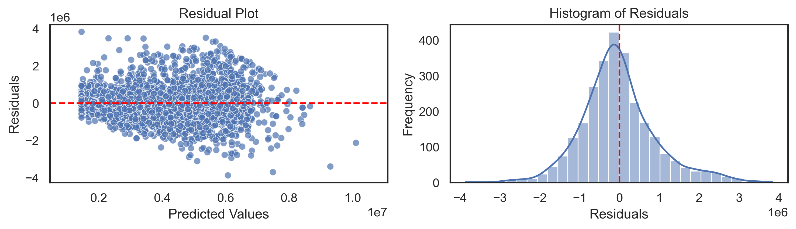

##  Project 2: Bangkok Housing Data | README

---

**README** | [Part 1: Cleaning Datasets](code/01_Clean.ipynb) | [Part 2: Regression Model](code/02_Regression.ipynb) | [Part 3: Interpretation](code/03_Interpretation.ipynb)

---

### Introduction

The purpose of **Project Bangkok Housing Data** is to learn and apply linear regression, one of the most common predictive tools. This project utilizes data collected in late 2023 on various attributes and prices of three property types — Condo, Detached House, and Townhouse — in Bangkok, Nonthaburi, and Samut Prakan. The primary goal of the linear regression model is to predict the target variable, `y`, which represents price. However, the analysis results offer valuable insights beyond just the target price.

---

### Exploratory Data Analysis

The data comes from two sources: `./data/train.json` and `./data/test.json`, with a combined total of 24 columns and 16,722 rows. However, the `price` column in the test data is missing, as it is intended for prediction purposes.

Each column of the data requires cleaning, and various methods are employed for this purpose due to several reasons, including redundant information, missing data, outliers, strong relationships between independent variables, and significant skewness. The cleaned data is then stored as `./data/housing_clean.csv`.

Several columns contain information about the location of properties. Only `province` and `district` are retained as the main information, while the columns `subdistrict`, `address`, `latitude`, and `longitude` are classified as redundant and dropped.

The columns `total_units` and `month_built` contain a significant amount of missing data; therefore, they have been dropped. For the `floor_level` column, which has a small amount of missing data, the missing values are filled with the median by property type.

Properties that exceed the `price` IQR bounds are classified as outliers and removed from the training dataset.

The columns that exhibit significant skewness are `floor_area` and `land_area`. Therefore, they are transformed into `log_floor_area` and `log_land_area` using a logarithmic transformation. The values of `nearby_bus_stops` are dominated by large numbers; consequently, it is transformed into `has_bus_stops`, a binary value.

Since the `price` of each `property_type` varies over time, we created the `year_built_bin` to capture different periods.

Here is the table of data dictionary:

| Column Name                   | Data Type   | Description                                | Example                              |
|-------------------------------|-------------|--------------------------------------------|--------------------------------------|
| id                            | int64       | Unique identifier for each property        | 1                                    |
| province                      | object      | Province where the property is located     | Bangkok, Nonthaburi, Samut Prakan   |
| district                      | object      | District where the property is located     | Ratchathewi                          |
| property_type                 | object      | Type of property                           | Condo, Detached House, Townhouse     |
| bedrooms                      | float64     | Number of bedrooms in the property         | 2.0                                  |
| baths                         | float64     | Number of bathrooms in the property        | 1.0                                  |
| floor_area                    | int64       | Floor area of the property in square meters| 50                                   |
| log_floor_area                | float64     | Log-transformed floor area                 | 3.912                                |
| floor_level                   | float64     | Level of the floor (0 if not Condo)       | 5.0                                  |
| land_area                     | float64     | Land area of the property in square meters (0 if Condo)| 100                        |
| log_land_area                 | float64     | Log-transformed land area (0 if Condo)    | 4.605                                |
| nearby_stations               | int64       | Number of nearby stations                  | 2                                    |
| nearest_station_name          | object      | Name of the nearest station (NaN if not any) | BL22 Sukhumvit MRT                |
| nearest_station_distance       | int64       | Distance to the nearest station in meters (0 if not any) | 500                          |
| nearby_supermarkets           | float64     | Number of nearby supermarkets               | 1.0                                  |
| has_many_bedrooms             | int64       | Indicator if it has many bedrooms (1/0)   | 1                                    |
| has_many_baths                | int64       | Indicator if it has many baths (1/0)      | 0                                    |
| has_bus_stops                 | int64       | Indicator if it is near bus stops (1/0)   | 1                                    |
| year_built_bin                | category    | Year built categorized (e.g., before 2000, between 2011 and 2015) | 2011_2015          |
| has_security                  | int64       | Indicator if there is security (1/0)      | 1                                    |
| has_pool                      | int64       | Indicator if there is a pool (1/0)        | 0                                    |
| has_sports                    | int64       | Indicator if there are sports facilities (1/0)| 1                               |
| has_parking                   | int64       | Indicator if there is parking (1/0)       | 1                                    |
| price                         | float64     | Price of the property (NaN if testing data)| 3,500,000                            |
| is_train                      | int64       | Indicator if it is a training data (1/0)  | 1                                    |

The least number of bedrooms and bathrooms classified as **Has Many** is shown in the following table:

| Property Type      | Has Many Bedrooms | Has Many Baths |
|--------------------|------------------|----------------|
| Condo              |        2          |       2         |
| Detached House     |        6          |        5        |
| Townhouse          |         4         |        5        |

### Linear Regression Model OLS

The linear regression model is conducted using the `OLS` method from the `statsmodels.api` library. The categorical variables — `province`, `district`, `property_type`, `nearest_station_name`, and `year_built_bin` — are transformed into dummy variables with the baseline being **an unknown-aged Detached House in Phra Khanong, Bangkok, that has no nearest station**.

In essence, interactions between `bedrooms` and `baths` are created, along with six new interactions among the facilities: `has_security`, `has_pool`, `has_sports`, and `has_parking`.

After iterating the model two times, all coefficients, except for the dummy variables, are significant at the 0.05 level (see [Model Statistic](data/model_stats.csv)). Subsequently, the model fine-tunes the results that exceed the lower bound to align with the lower bound calculated from the optimal quantile price in the training set (1,457,477 baht).

In summary, the final model achieves a score of **0.767** and a root mean squared error (RMSE) of **941,688** on the training data. For the testing data, the model's score is **0.763**, with an RMSE of **941,016**. Since the training and testing scores are both good and closely aligned, the model effectively satisfies the bias-variance tradeoff.

### Interpretation

One of the key advantages of linear regression is the interpretability of its [coefficients](data/model_summary.csv). This means that each coefficient provides clear insights into the relationship between the independent variables and the dependent variable. Below are interpretations derived from the coefficients of the model, note that when certain variables are mentioned, it is understood that any other variables not currently discussed are considered constant:

- The expected price of a Condo will be approximately 3 million baht higher than that of a Detached House. In the case of a Townhouse, the expected price will be approximately 1 million baht lower than that of a Detached House.

- Properties in Nonthaburi and Samut Prakan are expected to be 836,000 baht and 776,000 baht cheaper, respectively, compared to those in Bangkok. The most affordable properties are in Nong Chok, priced 2.27 million baht lower than in Phra Khanong, while Watthana features the highest property prices, which are 1.96 million baht more than in the same area.

- The baseline for property pricing is set for those without nearby stations, with each additional station increasing the expected price by 115,000 baht. Conversely, properties decrease in value by 1,200 baht for each meter further from the nearest station. Specifically, properties near Kan Kheha BTS are anticipated to be 624,000 baht cheaper, while those close to Silom MRT are projected to command a premium of 3.45 million baht.

- Since `log_floor_area` and `log_land_area` are in logarithmic form, a 1% increase in either `floor_area` or `land_area` results in an approximate increase in price equal to 1% times their respective coefficients. Specifically, a 1% increase in `floor_area` raises the price by about 15,000 baht, and a similar increase in `land_area` adds roughly 6,300 baht to the price.

- Bedrooms and bathrooms have an interactive effect on property value, with bathrooms impacting value more strongly than bedrooms. Notably, the negative coefficient on the `bed_bath` interaction term indicates that an excessive number of bedrooms or bathrooms may actually reduce property value, rather than enhance it, suggesting diminishing returns past a certain point. Therefore, a balanced configuration of bedrooms and bathrooms is essential for maximizing value. Properties with many bedrooms (defined as at least 2 in Condos, 6 in Detached Houses, and 4 in Townhouses) are expected to have prices approximately 172,000 baht higher.

- The presence of nearby supermarkets increases property prices by 10,000 baht per market, while proximity to bus stops adds an estimated 185,000 baht. Properties with only a parking lot show a negative impact of -326,000 baht on value, indicating that a parking lot alone does not substantially enhance value. To optimize property value, additional features like security and a pool are recommended.

- Overall, newer builds, particularly from 2016 onward, tend to strongly increase property values, while older constructions, especially pre-2000, have a negative impact.

