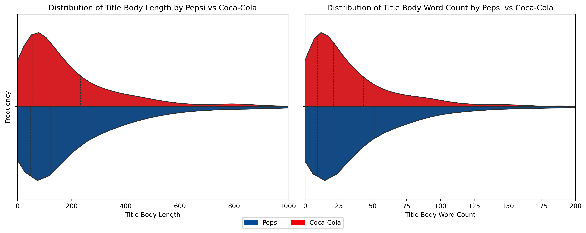
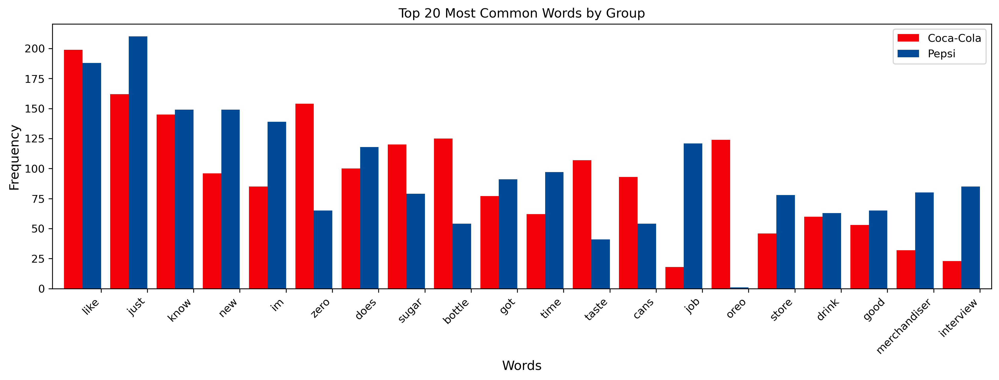
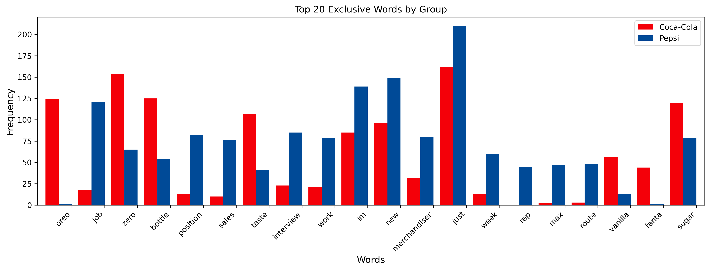
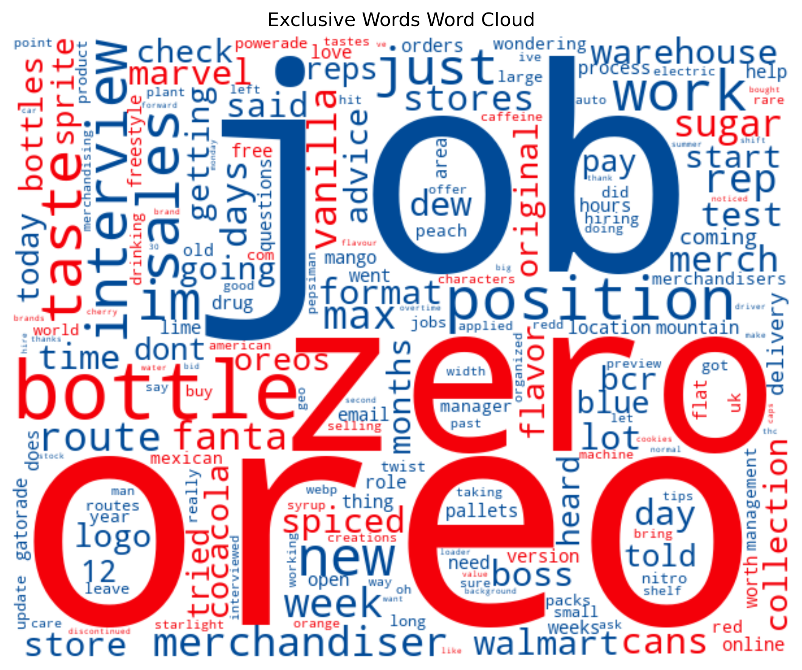

##  Project 3: NLP Classification: Subreddit Pepsi vs Coca-Cola | README

**README** | [Part 1: EDA](code/01_EDA.ipynb) | [Part 2: Vectorizer](code/02_Vectorizer.ipynb) | [Part 3: zzz](code/03_Interpretation.ipynb)

---

### Introduction

The goal of **NLP Classification**: Subreddit Pepsi vs Coca-Cola** is to leverage natural language processing (NLP) techniques for classifying text data based on subreddit discussions about **Pepsi** and **Coca-Cola**. To accomplish this, several key NLP concepts need to be applied:

**Tokenization**: Breaking down the text into smaller units (tokens) such as words, phrases, or characters. This process helps in understanding the structure and content of the text.

**Vectorization**: Converting the tokenized text into numerical representations that machine learning algorithms can process. Techniques like `CountVectorizer` and `TF-IDF Vectorizer` are used to transform text into vectors based on word frequency or importance.

**Classification**: Applying machine learning classifiers to predict the category (Pepsi or Coca-Cola) of the text. This involves training models using algorithms such as `Naive Bayes`, `Logistic Regression`, or more complex models like `Random Forest` or `XGBoost`.

---

### Exploratory Data Analysis

We will explore the distinguishing patterns between two subreddits: **Pepsi** and **Coca-Cola** and. The data from both subreddits has been extracted into the file `subreddit_pepsi_vs_cocacola.csv` using Reddit APIs.

Although the dataset contains many columns, we have cleaned and filtered it to use only a few key columns. The following data dictionary outlines the relevant columns included in the analysis.

| Column Name            | Data Type | Description                                                     | Example                                                            |
|------------------------|-----------|-----------------------------------------------------------------|--------------------------------------------------------------------|
| title_body             | object    | The concatenation of the title and body of the subreddit post   | Happy Veterans Day! Coca-Cola poster sealed down...               |
| title_body_length      | int64     | The length of the post in terms of characters (including spaces) | 50                                                                 |
| title_body_word_count  | int64     | The word count of the post                                      | 25                                                                 |
| is_pepsi               | int64     | Indicator if the post is about Pepsi (1 = Pepsi post, 0 = Coca-Cola post) | 1                                                                 |

Upon further exploration, we observed the following key points:
- **Similarities in Lower Quartiles**: Both **Pepsi** and **Coca-Cola** show similar patterns in the first quartile and median, with only slight differences.
- **Differences in Higher Quartiles**: The third quartile and maximum values show clear differences, with **Pepsi** generally having longer titles (both in terms of length and word count) at the higher end of the distributions.

This distinction in the higher quartiles is visually captured in the *violin plots*, which illustrates the spread of post lengths and word counts for both brands. The plot clearly shows that Pepsi posts have a wider distribution at the top end, reflecting more variation in post lengths, while Coca-Cola posts cluster more tightly around shorter lengths.

After performing vectorization using **CountVectorizer** and removing brand-specific words, we ended up with 6,309 features in the dataset. This extensive feature set captures the diversity of words used in the posts across both brands.

Top 20 Common Words: The most frequently occurring words in the dataset across both **Pepsi** and **Coca-Cola** include terms such as "like," "just," "know," "new," "im," "zero," "does," "sugar," "bottle," "got," "time," "taste," "cans," "job," "oreo," "store," "drink," "good," "merchandiser," and "did." These words reflect the general discourse that is not brand-specific but is commonly found in many conversations or posts, making them typical of social media communication.

Interestingly, the word *oreo* is predominantly used in discussions about Coca-Cola, setting it apart as a distinctive word for this brand. This word will be classified as an "exclusive word" for Coca-Cola, as its use is rare in Pepsi posts. The inclusion of such exclusive words helps in better distinguishing between the two brands in our classification model. Below is a bar chart that shows the exclusive words and their occurrences.

Thus, we summarize the findings with a word cloud showing the dominance of exclusive words. Words in blue occur significantly more in **Pepsi** posts, while words in **red** are more prevalent in Coca-Cola posts.

