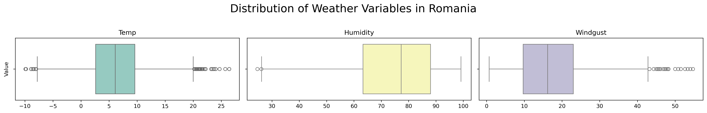
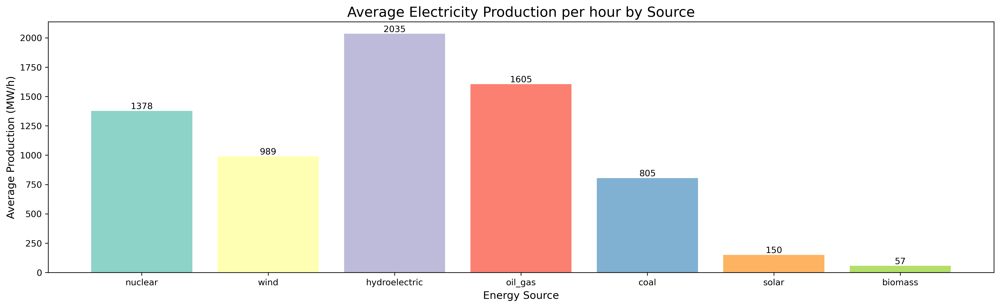
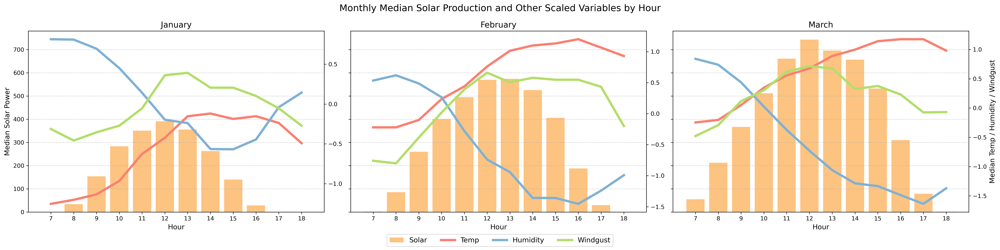
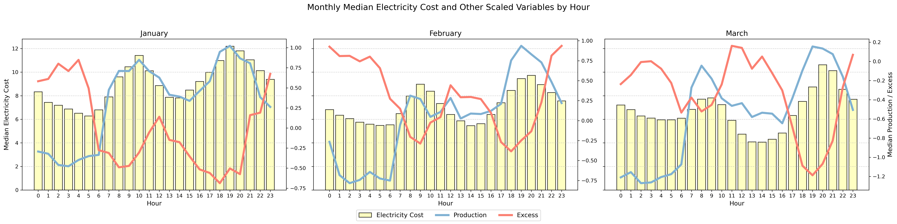

# 

## Project Capstone

### Reducing Electricity Costs in Romania: Predictive and Reinforcement Learning for Solar Power Optimization

---

**README** | [Part 1: Cleaning](01_Cleaning.ipynb) | [Part 2: EDA](02_EDA.ipynb)

---

### Introduction
- Romania, located in Europe with Bucharest as its capital city, relies on a diverse array of electricity production sources including nuclear, wind, hydroelectric, oil and gas, coal, solar, and biomass. Given that significant portion of its power is generated from natural sources, weather conditions play a crucial role in determining hourly production levels.
- Romania also exports electricity when there is excess production, leading to lower electricity costs durinng these periods. Additionally, peak hours are another important factor influencing electricity prices.
- For individuals, installing solar panels at home can significantly enhance comfort and reduce costs. By analyzing data on hourly solar generation and electricity costs, homeowners can optimize the timing of charging and discharging their batteries, ultimately minimizing their electricity expense.
- In this study, we will develop two regression models: one to predict hourly solar power generation based onn weather conditions, and another to estimate hourly electricity costs from electricity production. Additionally, we will design an optimization model using reinforcement learning to minimize electricity costs, taking into account the predicted solar power available and electricity prices at each hour.

### Datasources and Data Dictionary
- The data was extracted from 3 sources:
  - Weather in Bucharest, Romania: **[Visual Crossing's weather data services](https://www.visualcrossing.com/weather/weather-data-services/Bucharest,Romania/metric/)**
  - Electricity Cost per Hour: **[Thingler](https://thingler.io/country/Romania)**, by interpreting the bar charts and making personal notes
  - Electricity Production per Hour: **[Kaggle](https://www.kaggle.com/datasets/stefancomanita/hourly-electricity-consumption-and-production)**
- All three datasets cover the period from January 2024 to March 2024 on hourly basis. The data for March 31, 2024 was intentionally removed due to missing one hour because of daylight saving adjustments.
- Finally, all three datasets were cleaned and merged into a single file, [electricity_romania.csv](./data/cleaned/electricity_romania.csv). The data dictionary is provided below.

| Column Name          | Description                                                      | Data Type       |
|----------------------|------------------------------------------------------------------|-----------------|
| `datetime`           | Date and time of the record                                      | `datetime64[ns]`|
| `temp`               | Temperature in Bucharest (Celsius)                               | `float64`       |
| `feelslike`          | Feels-like temperature (Celsius)                                 | `float64`       |
| `dew`                | Dew point temperature (Celsius)                                  | `float64`       |
| `humidity`           | Relative humidity percentage                                     | `float64`       |
| `windgust`           | Wind gust speed                                                  | `float64`       |
| `windspeed`          | Wind speed                                                       | `float64`       |
| `winddir`            | Wind direction                                                   | `float64`       |
| `sealevelpressure`   | Sea level pressure                                               | `float64`       |
| `cloudcover`         | Percentage of cloud cover                                        | `float64`       |
| `visibility`         | Visibility distance (km)                                         | `float64`       |
| `has_snow`           | Indicates if there is snow (binary: 0 = no, 1 = yes)             | `int32`         |
| `has_solarradiation` | Indicates if there is solar radiation (binary: 0 = no, 1 = yes)  | `int32`         |
| `icon_cloudy`        | Icon representing cloudy weather (binary: 0 = no, 1 = yes)       | `float64`       |
| `icon_fog`           | Icon representing fog weather (binary: 0 = no, 1 = yes)          | `float64`       |
| `icon_partly_cloudy` | Icon representing partly cloudy weather (binary: 0 = no, 1 = yes)| `float64`       |
| `icon_rain`          | Icon representing rain weather (binary: 0 = no, 1 = yes)         | `float64`       |
| `icon_snow`          | Icon representing snow weather (binary: 0 = no, 1 = yes)         | `float64`       |
| `ckwh`               | Electricity cost (cent of euro) per hour in Romania              | `float64`       |
| `consumption`        | Electricity consumption per hour                                 | `int64`         |
| `production`         | Electricity production per hour                                  | `int64`         |
| `nuclear`            | Nuclear energy production (MWs) per hour                         | `int64`         |
| `wind`               | Wind energy production (MWs) per hour                            | `int64`         |
| `hydroelectric`      | Hydroelectric energy production (MWs) per hour                   | `int64`         |
| `oil_gas`            | Oil and gas energy production (MWs) per hour                     | `int64`         |
| `coal`               | Coal energy production (MWs) per hour                            | `int64`         |
| `solar`              | Solar energy production (MWs) per hour                           | `int64`         |
| `biomass`            | Biomass energy production (MWs) per hour                         | `int64`         |

### Exploratory Data Analysis

#### General Information
- **Weather**
    - The weather in Romania displays a significant range, with average temperatures around $6^\circ C$, although they can drop to $-9.9^\circ C$ and rise up to $26.4^\circ C$.
    - Humidity levels are generally high, averaging $74\%$, indicating a releatively humid environment.
    - Wind conditions vary considerably, with average wind gusts arounds $17.4$ kilometers per hour and reaching up to $54.7$ kilometers per hour.
    - Overall, Romania experiences a wide variety of weather conditions, with notable fluctuations in temperature, humidity, and wind gusts througout the first quarter of the year.

  
- **Electricity Production**
  - The three primary sources of electricity in Romania are hydro electric, producing $2,035$ Megawatts per hour, oil and gas, generating $1,605$ Megawatts per hour, and nuclear, contributing $1,378$ Megawatts per hour.
  - Solar power is not a main source of electricity, producing around $150$ Megawatts per hour and is only available during daylight hours, typically between 7AM and 6PM.

#### Relationship between Weather and Solar Energy
- Solar energy values exhibit a normal distribution throughout the day, spanning from 7:00 AM to 6:00 PM, with peak production around noon. Over the months, there is a noticeable increase in solar power generation, particularly from January to March.
- Temperature and wind show a positive relationship with solar power, while humidity shows a negative relationship.
- In general, higher temperatures are associated with lower humidity and stronger wind gusts, while lower temperatures are associated with higher humidity and weaker wind gusts.

#### Relationship between Electricity Production and Electricity Cost per Hour
- Electricity cost fluctuate based on peak hours (9-11 AM, 5-7 PM) and off-peak hours.
- Electricity costs are positively related to energy consumption, energy production, annd the production of hydroelectric, oil and gas, and coal. However, when there is excess production, electricity costs decrease, showing a negative relationship.
- Note that, production encompasses the total output from all energy sources, effectively representinng the overall energy generatioin. Therefore, it's unnecessary to consider the contributions from individual energy sources separately.

