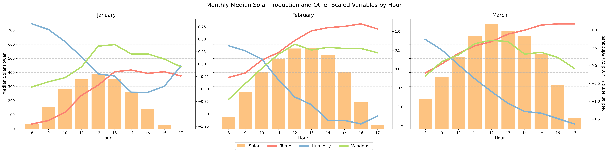

# 

## Project Capstone

### Reducing Electricity Costs in Romania: Predictive and Reinforcement Learning for Solar Battery Optimization

---

**README** | [Part 1: Cleaning](code/01_Cleaning.ipynb) | [Part 2: EDA](code/02_EDA.ipynb) | [Part 3: Solar Energy Prediction Models](code/03_Model_Solar_Energy.ipynb) | [Part 4: Electricity Cost Prediction Models](code/04_Model_Electricity_Cost.ipynb) |  [Part 5: Electricity Cost Prediction Using Time Series Models](code/05_Model_Electricity_Cost_ts.ipynb) [Part 6: Solar Battery Optimization](code/06_Reinforcement_Learning.ipynb)

---

### Introduction
- Romania, located in Europe with Bucharest as its capital city, relies on a diverse array of electricity production sources including nuclear, wind, hydroelectric, oil and gas, coal, solar, and biomass. Given that significant portion of its power is generated from natural sources, weather conditions play a crucial role in determining hourly production levels.
- Romania also exports electricity when there is excess production, leading to lower electricity costs durinng these periods. Additionally, peak hours are another important factor influencing electricity prices.
- For individuals, installing solar panels at home can significantly enhance comfort and reduce costs. By analyzing data on hourly solar generation and electricity costs, homeowners can optimize the timing of charging and discharging their batteries, ultimately minimizing their electricity expense.
- This study will develop two regression models: one to predict hourly solar power generation based on weather conditions, and another to estimate hourly electricity costs from electricity production.
Additionally, a time series model will be constructed to independently forecast hourly electricity costs.
Furthermore, an optimization model using reinforcement learning will be designed to minimize electricity costs, considering the predicted solar power availability and electricity prices for each hour.

### Datasources and Data Dictionary
- The data was extracted from 3 sources:
  - Weather in Bucharest, Romania: **[Visual Crossing's weather data services](https://www.visualcrossing.com/weather/weather-data-services/Bucharest,Romania/metric/)**
  - Electricity Cost per Hour: **[Thingler](https://thingler.io/country/Romania)**, by interpreting the bar charts and making personal notes
  - Electricity Production per Hour: **[Kaggle](https://www.kaggle.com/datasets/stefancomanita/hourly-electricity-consumption-and-production)**
- All three datasets cover the period from January 2024 to March 2024 on hourly basis. The data for March 31, 2024 was intentionally removed due to missing one hour because of daylight saving adjustments.
- Finally, all three datasets were cleaned and merged into a single file, [electricity_romania.csv](./data/cleaned/electricity_romania.csv). The data dictionary is provided below.

| Column Name          | Description                                                      | Data Type       |
|----------------------|------------------------------------------------------------------|-----------------|
| `datetime`           | Date and time of the record                                      | `datetime64[ns]`|
| `temp`               | Temperature in Bucharest (Celsius)                               | `float64`       |
| `feelslike`          | Feels-like temperature (Celsius)                                 | `float64`       |
| `dew`                | Dew point temperature (Celsius)                                  | `float64`       |
| `humidity`           | Relative humidity percentage                                     | `float64`       |
| `windgust`           | Wind gust speed                                                  | `float64`       |
| `windspeed`          | Wind speed                                                       | `float64`       |
| `winddir`            | Wind direction                                                   | `float64`       |
| `sealevelpressure`   | Sea level pressure                                               | `float64`       |
| `cloudcover`         | Percentage of cloud cover                                        | `float64`       |
| `visibility`         | Visibility distance (km)                                         | `float64`       |
| `has_snow`           | Indicates if there is snow (binary: 0 = no, 1 = yes)             | `int32`         |
| `has_solarradiation` | Indicates if there is solar radiation (binary: 0 = no, 1 = yes)  | `int32`         |
| `icon_cloudy`        | Icon representing cloudy weather (binary: 0 = no, 1 = yes)       | `float64`       |
| `icon_fog`           | Icon representing fog weather (binary: 0 = no, 1 = yes)          | `float64`       |
| `icon_partly_cloudy` | Icon representing partly cloudy weather (binary: 0 = no, 1 = yes)| `float64`       |
| `icon_rain`          | Icon representing rain weather (binary: 0 = no, 1 = yes)         | `float64`       |
| `icon_snow`          | Icon representing snow weather (binary: 0 = no, 1 = yes)         | `float64`       |
| `ckwh`               | Electricity cost (cent of euro) per hour in Romania              | `float64`       |
| `consumption`        | Electricity consumption per hour                                 | `int64`         |
| `production`         | Electricity production per hour                                  | `int64`         |
| `nuclear`            | Nuclear energy production (MWs) per hour                         | `int64`         |
| `wind`               | Wind energy production (MWs) per hour                            | `int64`         |
| `hydroelectric`      | Hydroelectric energy production (MWs) per hour                   | `int64`         |
| `oil_gas`            | Oil and gas energy production (MWs) per hour                     | `int64`         |
| `coal`               | Coal energy production (MWs) per hour                            | `int64`         |
| `solar`              | Solar energy production (MWs) per hour                           | `int64`         |
| `biomass`            | Biomass energy production (MWs) per hour                         | `int64`         |

### Exploratory Data Analysis

#### General Information
- **Weather**
    - The weather in Romania displays a significant range, with average temperatures around $6^\circ C$, although they can drop to $-9.9^\circ C$ and rise up to $26.4^\circ C$.
    - Humidity levels are generally high, averaging $74\%$, indicating a releatively humid environment.
    - Wind conditions vary considerably, with average wind gusts arounds $17.4$ kilometers per hour and reaching up to $54.7$ kilometers per hour.
    - Overall, Romania experiences a wide variety of weather conditions, with notable fluctuations in temperature, humidity, and wind gusts througout the first quarter of the year.

  
- **Electricity Production**
  - The three primary sources of electricity in Romania are hydro electric, producing $2,035$ Megawatts per hour, oil and gas, generating $1,605$ Megawatts per hour, and nuclear, contributing $1,378$ Megawatts per hour.
  - Solar power is not a main source of electricity, producing around $150$ Megawatts per hour and is only available during daylight hours, typically between 7AM and 6PM.

#### Relationship between Weather and Solar Energy
- Solar energy values exhibit a normal distribution throughout the day, spanning from 7:00 AM to 6:00 PM, with peak production around noon. Over the months, there is a noticeable increase in solar power generation, particularly from January to March.
- Temperature and wind show a positive relationship with solar power, while humidity shows a negative relationship.
- In general, higher temperatures are associated with lower humidity and stronger wind gusts, while lower temperatures are associated with higher humidity and weaker wind gusts.

#### Relationship between Electricity Production and Electricity Cost per Hour
- Electricity cost fluctuate based on peak hours (9-11 AM, 5-7 PM) and off-peak hours.
- Electricity costs are positively related to energy consumption, energy production, annd the production of hydroelectric, oil and gas, and coal. However, when there is excess production, electricity costs decrease, showing a negative relationship.
- Note that, production encompasses the total output from all energy sources, effectively representinng the overall energy generatioin. Therefore, it's unnecessary to consider the contributions from individual energy sources separately.

### Solar Energy Prediction Models
- Three algorithms were implemented: ordinary linear regression, random forest regressor, and the best performer, **gradient boosting**.
- After tuning, the improved gradient boost model achieved an R-squared of 1.00 on the training set and 0.90 on the testing set.
- The top three weather-related features influencing the model are `cloudcover`, `humidity`, and `has_solarradiation`.

In fact, the ordinary linear regression model constructed has a balanced R-squared with no overfitting, achieving 0.72 on the training set and 0.69 on the testing set. However, the scores can be improved using another model, even if it introduces a slight defree of overfitting.

### Electricity Cost Prediction Models
- Five algorithms were implemented: ordinary linear regression, random forest regressor, gradient boosting, adaptive boosting, and the best performer, extreme gradient boosting.
- Ordinary linear regression and adaptive boosting showed no sign of overfitting, with R-squared values on the testing set ranging from 0.61 to 0.69.
- On the other hand, random forest regressor, gradient boosting, and extreme gradient boosting achieved R-squared values close to 1.00 on the training set but around 0.80 on the testing set, indicating some overfitting.
- **Extreme gradient boosting** underwent hyperparameter tuning, achieving an R-squared of 1.00 on the training set and 0.83 on the testing set.
- The top three energy-related features influencing the model are `consumption`, `oil_gas`, and `solar`. 

In practice, to forecast the hourly electricity cost for tomorrow, the energy production for each hour of tomorrow must first be known. However, this is often difficult to obtain due to the variablity of energy sources, such as fluctuating renewable energy production and unpredictable demand patterns. This makes time series analysis an essential approach.

The time series analysis was conducted using **SARIMAX**. 
The ADF test showed stationarity of the data, and both the ACF and PACF confirmed a seasonality of 24-hour period.
After applying a log transform on the hourly electricity cost, the model achieved a root mean squared error of 2.22 cents per kilowatt,
calculated as the difference between the actual and forecasted values over the last 168 hours of data.

However, the R-squared of the time series model is 0.54, which is significantly lower than that of the XGBoost model, which stands at 0.83.
This discrepancy arises because the time series model lacks complexity, as it does not incorporate many features.

### Solar Battery Optimization

- A solar battery is a device that stores energy generated by solar panels for later use.
- **Charging** a solar battery involves storing excess energy generated by the solar panel. When a solar battery is charging, it is in a state of receiving energy and cannot simultaneously discharge or supply power to the system.
- **Discharging** occurs when the stored energy in the solar battery is used to supply power to the system. When a solar battery is discharging, it cannot simultaneously charge as it is in a state of providing energy.
- An optimization model using reinforcement learning will be designed to minimize electricity costs, considering the predicted solar power availability and electricity prices for each hour. The model will learn when to charge or discharge the solar battery based on the current state, optimizing the use of stored energy to ensure efficiency and cost-effectiveness.
